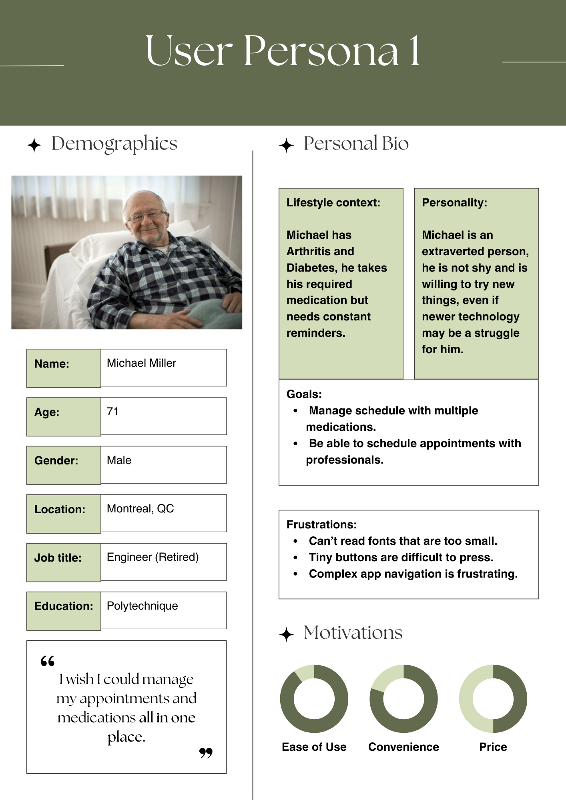
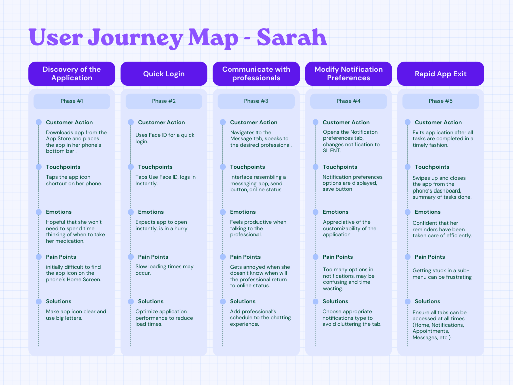
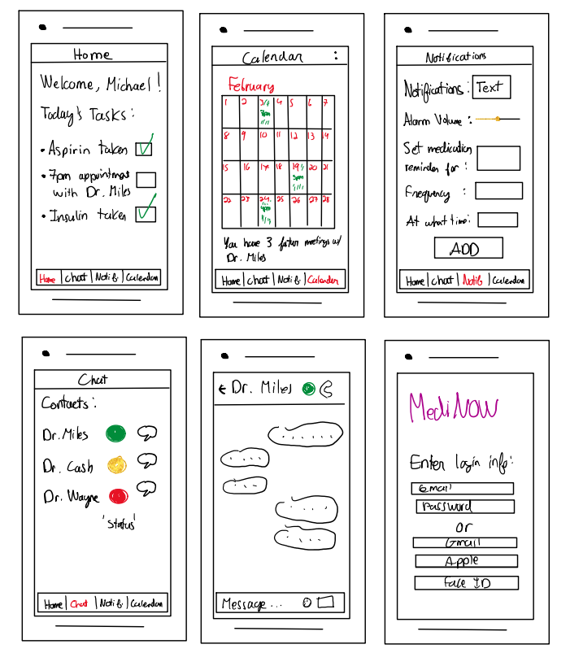
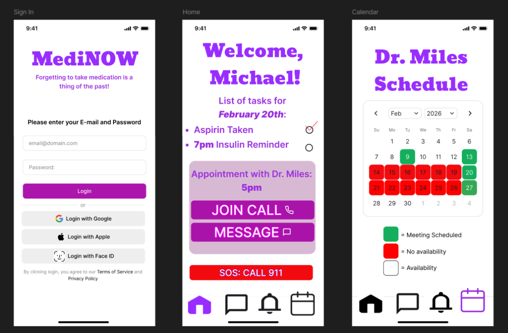
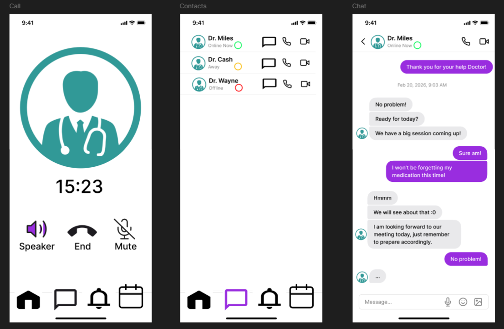
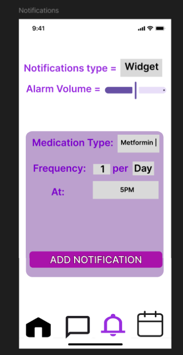
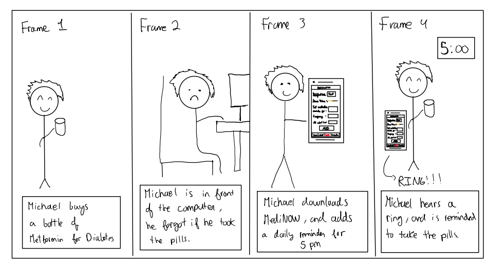
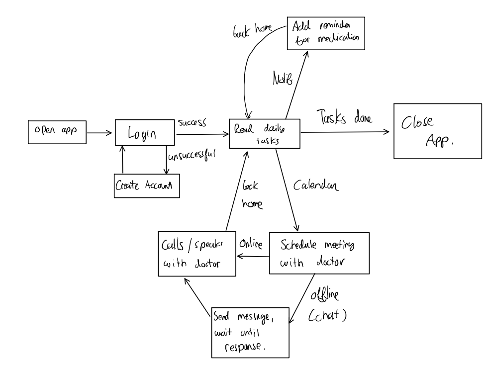
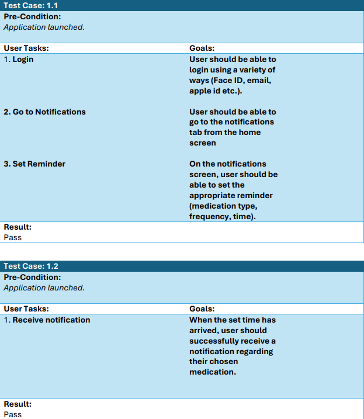
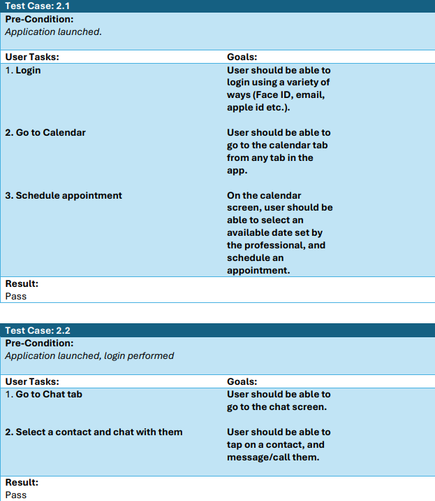

# Case Study: MediNOW Health Companion App
UX Case Study for the MediNOW app designed for SOEN 357

**Author:** Julian Valencia

[Prototype Link](https://www.figma.com/proto/jvvigXkKOMSKH5eb6iCNwV/Healthcare-App?node-id=1-2567&p=f&t=55H0asWPaKsvWieX-1&scaling=min-zoom&content-scaling=fixed&page-id=0%3A1&starting-point-node-id=1%3A2567&show-proto-sidebar=1)

# Introduction
The following report is based on the following scenario: We are given a mobile app to design,
which is aimed at helping individuals with chronic health conditions manage their medication and
doctor appointments. This mobile app should allow users to set reminders, track their medication
usage, as well as schedule meetings with health professionals.

To successfully design this mobile app for the target audience, we must follow a few sets of tasks.
Before starting the design process, we must conduct user research as well as create personas for
this app. We must then map the user journey that illustrates a typical process the user would go
through using the app. Then, we will create wireframes for our app as well as a clickable prototype
using a design tool (Figma). Finally, we will define a usability test plan and reflect on how the UX
design helped us identify the user needs as well as improvements for the app.

# User Research
In this section, we will discuss the methods used to obtain information on how our mobile
application should look and function. After finding a research method, we will create personas
based on our findings. We will include each persona’s goals, motivations and behaviors when
using the app.

The research method used for the purposes of our project will be searching through scholarly
articles using Google Scholar. This method will provide us with very useful statistics and
information regarding the target audience of our chosen application. We know that we are
targeting people with chronic health conditions, and we want to help them manage their
medication/doctor appointments. This means that we should perform research on this type of
individual
.
The first scholarly article used is from the National Library of Medicine(1), it talks about the
prevalence of Multiple Chronic Conditions (MCC), which will provide necessary information
regarding our target audience. As of 2010, 26% of American adults have multiple chronic
conditions, which solidifies the market need for our application. Age is an important factor in this
article, we can derive two personas based on the user’s age (persona 1: older person (65+ y.o),
persona 2: middle-aged individual (40-50 y.o)). According to Ward and Schiller’s findings, MCCs
tend to significantly increase with age(1). We would need to design our application in such a way
that it is very easy to understand and use with all age groups, especially middle-aged adults and
the elderly. Finally, Ward and Schiller have identified that the most common conditions consist of
Arthritis, Diabetes, and Hypertension, we would need to keep those conditions in mind when
designing the app (maybe keep track of blood pressure, glucose levels potentially through
tracking their medication usage etc.).

Now that we know more about the conditions these individuals have and their average age group,
we should do more research on how exactly to design our mobile application to fit their specific
needs. We will use the second scholarly article found, which talks about mobile application
development, specifically for the elderly class(2). Our mobile application should be very reliable
due to the fact that we are dealing with the health of our users, we would not want to convey
false information or not notify the user in time. Notifications should be loud and clear for anyone
to hear and see; the application must use a readable font with big characters and ensure that
navigation within our app is simple enough for anyone to use(2). Finally, scheduling appointments
or talking to a specialist should not be a hassle and should be intuitive to use.

Now that we have a clear idea on who our target audience is, we are ready to create our two
distinct Personas, as well as map their respecting user journeys.

# Persona 1

# Persona 2

# User Journey Mapping – Michael

With Michael’s user journey, we wanted to emphasize clarity and ease of use for our application.
We know that Michael has a bit of trouble when attempting to use newer technology, so we want
to make sure that the application is as easy to use as possible. It is extremely important to the
user that our application displays all of the necessary tabs (Home, Notifications, Appointments)
and provides a checklist of completed tasks, so that the user can safely exit the app knowing that
every important reminder was set, and all necessary appointments were scheduled.

# User Journey Mapping – Sarah

When it comes to Sarah’s user journey, we really want to emphasize the importance of our app’s
efficiency and lack of time wasting. All tasks can be done in a quick fashion, so that Sarah can
return to her job in as little time as possible. We do not want to take the user’s valuable time and
waste it; we must make sure that the available tasks can be done as efficiently as possible.

# Sketches

# Wireframes

# Design Choices
The first noticeable aspect of the app (MediNOW) is the vibrant purple color flowing through all
of the wireframes. Purple provides a strong contrast against white backgrounds, making it easy
to the eye of many individuals, as well as keeping a professional and modern aesthetic to the app.

Big tappable text boxes were included in the notifications tab for people with lower dexterity such
as Michael. Fonts are also pretty big, making it easy to read for people who can’t read fonts that
are too small. On the home menu, a large SOS button was added which calls 911 if the user
chooses to do so, this was included to allow instant access to help during emergencies. The home
menu includes the user’s tasks for the day as well as reminders for any medication needed and
appointments reminders. In this version of the app, the calendar redirects to your preferred
professional, which in this case is Dr. Miles. This is where you can see his availabilities.

We want to provide efficiency and speed, so no animations were included in the clickable
prototype as of yet. Other efficiency features include a one-tap login feature, as well as a join
call/message on the Appointment card on the home screen. This was designed while thinking of
people like Sarah who needs quick access to the important features as quickly as possible.

Customization is also an important factor of the app, notification volume can be reduced or
augmented, you can also add any kind of medication needed to be reminded of in the
notifications tab. All in all, all of the design choices were inspired by the research done using
scholarly articles, and by both personas created using those same articles.

# Storyboard

This story explains how a user like Michael would download MediNOW and how we would use
our app. Michael buys a bottle of Metformin from the pharmacy and goes back home. Time
passes and he has forgotten if he already took the pills for the day or not. To prevent this from
ever happening again, Michael downloads MediNOW and adds a daily reminder to take those
pills at 5pm every day. From here on out, Michael never misses a day since he can hear the loud
ringtone coming from his phone whenever it is time to take the pills.

# User Flow Chart

# Usability Testing
Test Plan 1: Set/Receive reminders to take medication

The user should be able to set their own reminders for taking medication at a specific time and
frequency

Test Plan 2: Schedule appointment and communicate with professionals

The user should be able to schedule appointments with their selected professional, as well as
communicate with them using text messages or calls.

# Analyzing Feedback from User Testing
After the first few initial designs of the app (based on the sketches), I realized a few things that
could be improved in the final version.

First of all, I noticed that the home screen was particularly empty and that it only included the
welcome message as well as the daily tasks. I wanted to include something pertinent in the empty
space left on that page, so I decided to add a quick message and quick call feature on the home
page. If a user has a meeting scheduled with a professional on that same day, they can quickly
call the professional or access the chat screen with the professional directly on the same page,
wasting as little time as possible.

Another thing I noticed was that the login page from my initial sketches had few options to
actually log in. You could only log in using your email and password or Face ID. I then altered my
initial sketch to include more login options. I wanted to include more options, so I added the
Google login as well as an Apple ID login, giving the users more ways to login. This also helps our
app be as efficient as possible.

Finally, my sketches were missing a Call screen, which is very important for this application since
we want users to have access to professionals in as many ways as possible. I promptly added this
screen in my prototype to simulate a user having to call a professional for their meeting.

# Reflection
Following the UX design process helped me greatly to design a visual prototype of a potential
healthcare application. Starting with the user research helped me identify the target audience
and aided me in creating the two personas for this project. The creation of personas is crucial for
designing a mobile application, you have to design something for a target audience, if not then
you are designing something for nobody in mind, which makes your design choices unfounded
and unguided.

Mapping the User Journey was also very helpful for the design of the application, as it helped me
identify the main pages I needed to include in the prototype (Login, Home, Chat, Notifications,
Calendar). It also helped me think about what emotion the user would go through after going
through each step of the user journey.

Before starting the prototype, it is crucial to have some sketches done to help visualize some of
the key aspects discussed in the previous sections, such as the User Journey Map. We took the
ideas from the user journey maps and turned them into sketches, which in turn helped us create
the wireframes on Figma. After the wireframes were finished, it was just a matter of linking the
clickable buttons to the corresponding screen to make a functioning visual prototype. The user
flow chart and storyboard also helped in linking the wireframes together for the visual prototype;
the flow chart specifically helped in a big way to see how each tab linked to one another. Finally,
the usability testing section helped us confirm that every task is achievable in our visual prototype
(set reminders, chat with professionals, schedule appointments with professional, track if
medication was taken etc.).

There were a couple of challenges during the design process. First of all, this was my first time
using Figma, so navigating the website and scrolling through the many options was challenging at
first. Second of all, thinking of the perfect persona took a lot of my time, so I settled with trying
to incorporate as many things as possible from the research done (appropriate age, multiple
chronic illnesses, bad eyesight, very busy schedule, etc.). Finally, going from sketch to wireframe
took a bit more time than I would have expected, due to thinking of many more options and
features will designing the wireframes (call screen, quick message, quick call etc.).

# References
[1]
B. W. Ward and J. S. Schiller, “Prevalence of Multiple Chronic Conditions Among US Adults:
Estimates From the National Health Interview Survey, 2010,” Preventing Chronic Disease, vol.
10, Apr. 2013, URL: (https://pmc.ncbi.nlm.nih.gov/articles/PMC3652717/)

[2]
I. Plaza, L. Martín, S. Martin, and C. Medrano, “Mobile applications in an aging society: Status
and trends,” Journal of Systems and Software, vol. 84, no. 11, pp. 1977–1988, Nov. 2011, URL:
(https://www.sciencedirect.com/science/article/abs/pii/S016412121100135X)
